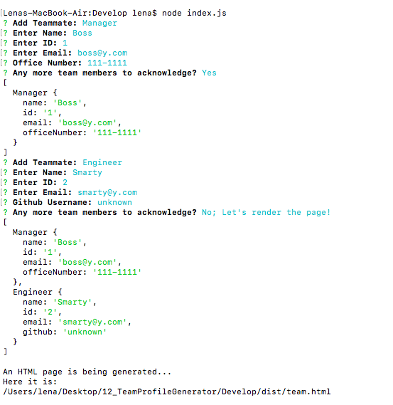
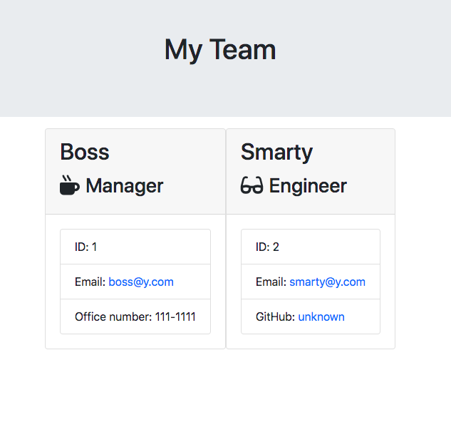
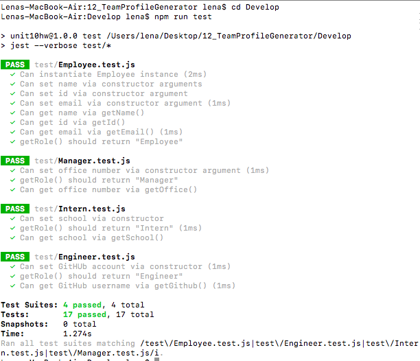

# 12 Object-Oriented Programming: Team Profile Generator

## Assignment

Your task is to build a Node.js command-line application that takes in information about employees on a software engineering team, then generates an HTML webpage that displays summaries for each person. Testing is key to making code maintainable, so you’ll also write a unit test for every part of your code and ensure that it passes each test.

## User Story

```md
AS A manager
I WANT to generate a webpage that displays my team's basic info
SO THAT I have quick access to their emails and GitHub profiles
```

## Command to Run App
```
node index.js
```


## Sample Output


## Testing Code Using Jest (for developers)
Download dependencies first
```
npm install
```
Then run tests via this command:
```
npm run test
```
